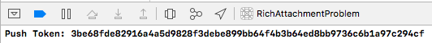
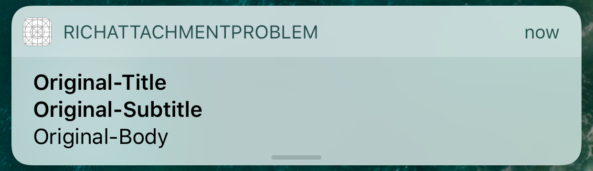
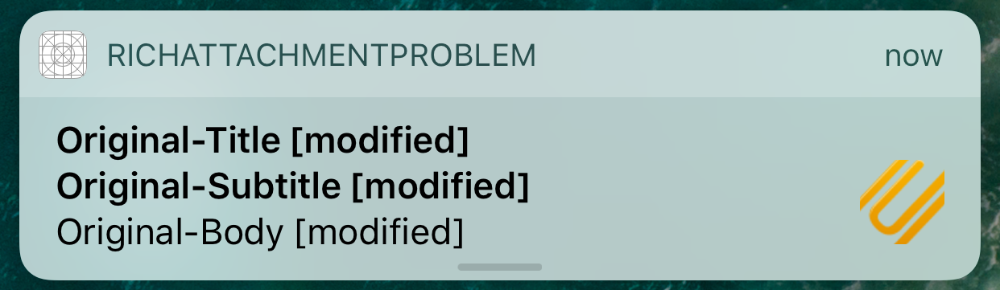

# Rich Push Attachment Problem using UNNotificationServiceExtension
**Problem in notification servic extension when we modify the content adding an attchment to it.**

> Before we decided to contact Apple, we tried everything came into our minds, but unfortunatelly without success.  

## References
We also participated in Apple's [forum](https://forums.developer.apple.com/message/193994) where people also complained about this issue.

## Issue
Our app uses [`UNNotificationServiceExtension`](https://developer.apple.com/documentation/usernotifications/unnotificationserviceextension) to handle and modify rich content.
We have an issue when we send a rich push with an **image attachment**, but it is reproducable only if you do a clean install of the app and reboot your device. The first push message the device recieves does not show the image and falls back to default message, discarding all other changes in content we did in our notification service extension.

When we send the same message again, everything works as expected, showing modified content in service extension and the image attachment.

**Important note:** The problem exists only if we change contnent's attachment. If we remove it and change other fiels like title, subtitle, body, everything works as expected.

## Requirements
- Xcode 8.x
- iOS 10.x device
- push certificate
- some pusher app - we use [this](https://github.com/noodlewerk/NWPusher)

## How To Reproduce
1. Perform clean install on a device (if the app was previously installed, delete it).
2. Run the app from Xcode
3. Allow notifications
4. In Xcode console you will find a "Push Token". Copy it.

5. Close the app - stop it.
6. Reboot the device.
7. Send a push
8. When you receive it on the device, you will see there is no attachmend image and title/subtitle/body are not modified.

Key step to reproduce it is to reboot your device. Problem exists regardless you've just installed the app on rebooted device, or run the app after device rebooted.

In step 8, we expect a message with attachment and modified title/subtitle/body, but we receive "original" message.


When you send the same message again, we receive it as expected.


## Push Payload
```json
{
    "aps" : {
        "alert" : {
            "title" : "Original-Title",
            "subtitle" : "Original-Subtitle",
            "body" : "Original-Body"
        },
        "badge" : 1,
        "sound" : "default",
        "category" : "DefaultCategory",
        "mutable-content" : 1
    },
    "attachment" : "https://cdn0.iconfinder.com/data/icons/customicondesignoffice5/128/attachment.png"
}
```

You can use as `attachment` value any downloadable image - max size is 10 MB.

## Our Observation
It seems to us there is some inter process communication problem when a device is rebooted. `didReceive` method from service extension runs in a separate process than main app and also in a background thread.

As stated in Apple's documentation for [`UNNotificationAttachment`](https://developer.apple.com/documentation/usernotifications/unnotificationattachment):
>The system validates the content of attached files before scheduling the corresponding notification request. If an attached file is corrupted, invalid, or of an unsupported file type, the notification request is not scheduled for delivery. Once validated, attached files are moved into the attachment data store so that they can be accessed by the appropriate processes. Attachments located inside an app’s bundle are copied instead of moved.

the system moves/copies the attachment. It seems to us there is some problem during the process of moving/coping, assing IPC rights, validating it. It fails, and the message is delivered without modified content. 

Why it shows original content is probably because the whole modified contant becomes invalid because of the attachment. As stated in Apple's documentation for [`didReceive`](https://developer.apple.com/documentation/usernotifications/unnotificationserviceextension/1648229-didreceive):
>You can modify any of the content from the original request. You might customize the content for the current user or replace it altogether. You can use this method to download images or movies and add them as attachments to the content. You may also modify the alert text as long as you do not remove it. If the content object does not contain any alert text, the system ignores your modifications and delivers the original notification content.

Because of attachment, the whole content object is invalid, which means there is **no alert text**, and the system delivers the original notification content.

*Maybe this is just a guess, but we hope Apple can help.*

## Who we are?
> <a href="http://appculture.com"></a>
> 
> [www.appculture.com](https://appculture.com/)

*Thank you for any contribution to this issue! If you need more info, don't hesitate to contact us. We will appritiate it a lot.*